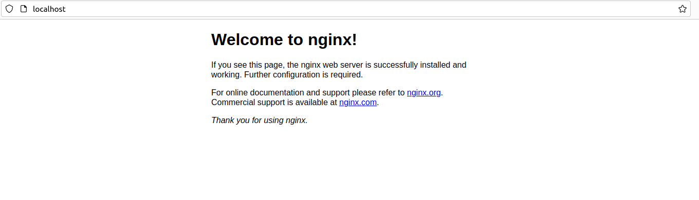

# Port 80 couldn't Use

If you try to set your own nginx.conf with port 80 in your server directive, you will find that no matter how you set the config file, it will show the default page as below.    

   

Don't worry if this happen to you. You only need to delete the `conf.d` folder in the path `/etc/nginx/conf.d`, or comment out the server directive in the config file in `conf.d`.